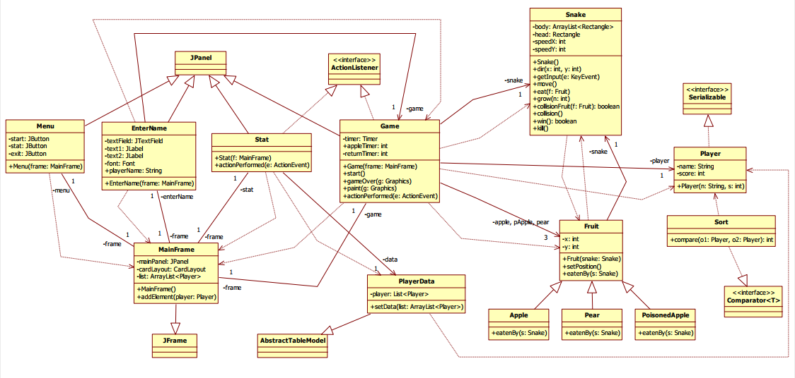
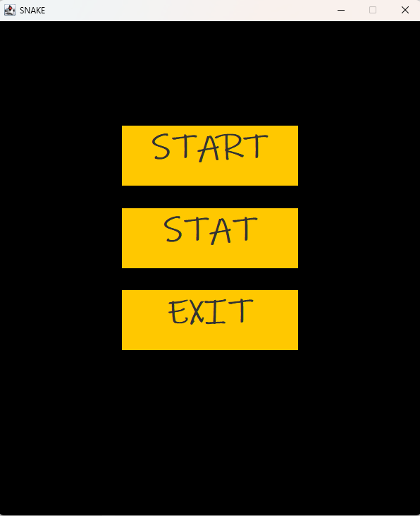
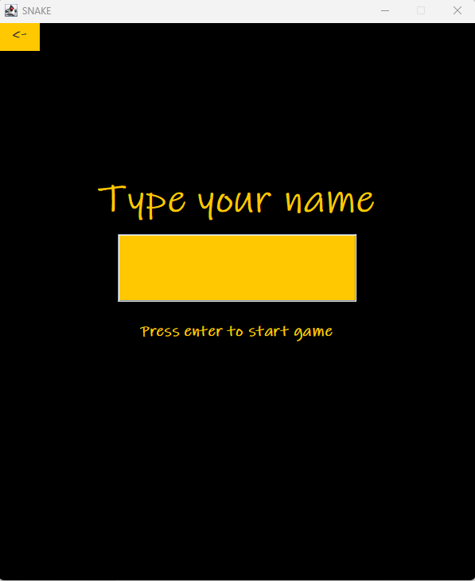
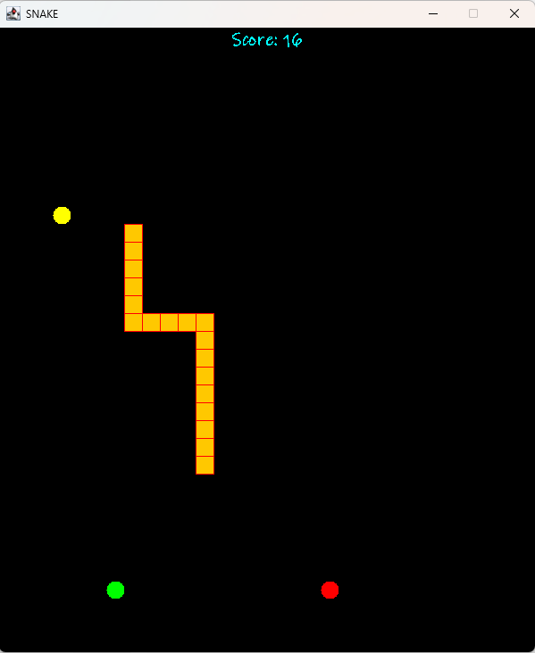
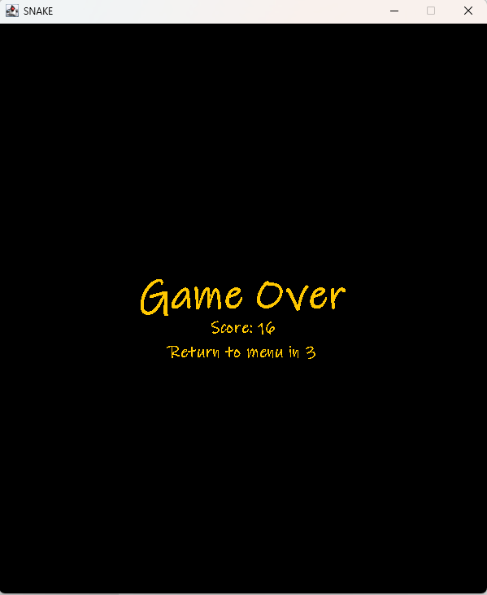
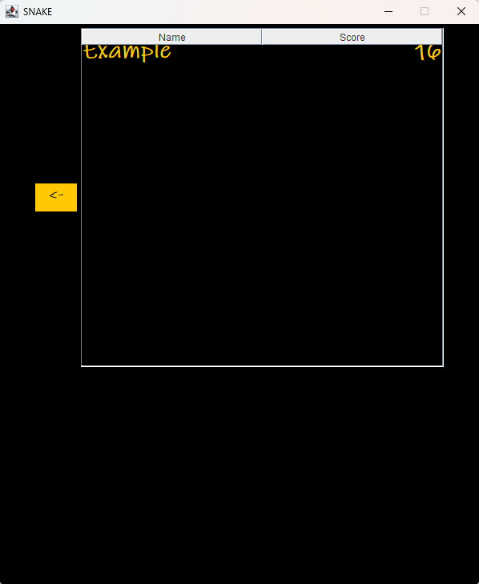

# Kígyó játék javaban

A program a klasszikus snake játékot valósítja meg javaban, néhány kiegészítéssel, Swing környezet 
segítségével, ahol a kígyót és a felvehető objektumokat külön alakzatok reprezentálják. 
A cél pedig, hogy a játékos a kígyót irányítva minél több, a pályán szereplő különböző 
objektumokat felvéve, egyre több pontot szerezzen.

## Felhasználói kézikönyv

### Játékszabályok

A játékos irányítja a kígyót, mely csak a mezőn, adott négy irányba haladhat (jobbra, balra, fel, 
le), és az adott irányt kiválasztva, annak ellentett irányába nem haladhat (ha jobbra megy a 
kígyó éppen, akkor balra nem mehet, hiszen nem tud hátrafele mozogni, illetve saját magával 
ütközne). A kígyó fel tudja venni (megenni) a pályán lévő objektumokat, ezek a különböző fajta 
gyümölcsök. A felvehető gyümölcsök más-más tulajdonsággal rendelkeznek. 

#### Pályán található gyümölcsök

- mérgezett alma: Zöld pöttyel van ábrázolva, bizonyos időközönként automatikusan pozíciót 
vált, megöli a kígyót.

- körte: Citromsárga pötty jelzi a pályán, ha a kígyó megeszi, a mérete két egységgel növekszik. 
Ez szintén bizonyos időközönként változtatja a pozícióját, a mérgezett almánál gyorsabban. Ha 
a kígyó megette, akkor is vált.

- alma: Piros pöttyel van ábrázolva, a kígyó méretét egy egységgel növeli elfogyasztáskor. A 
pozíciót ez nem változtat magától, csak akkor, ha a kígyó megette.

A kígyó meg tud halni, ha mérgezett almát evett, vagy ha saját magának, vagy éppen a falnak 
ütközik. A falat a megjelenített mező széle jelenti. A játék mindaddig folyik, amíg a kígyó meg 
nem hal. Játék vége esetén (game over) a program automatikusan elmenti a játékállást, ami a 
játékos által, a játék kezdete előtt megadott névből és a játék alatt megszerzett pontszámból áll.
A kígyót narancssárga négyzetek reprezentálják. Játék indításakor mindig a pálya közepétől 
indul el automatikusan jobbra, innentől kezdve pedig már a játékos feladata, annak irányítása.

### Bemenetek/Kimenetek

Az alapvető bemenetek közé tartoznak a nyíl gombok, melynek segítségével a kígyó 
irányítható. Egyéb bemenet és kimenet is, a játékállás tárolásához szükséges txt fájl, melybe 
kiírásra kerülnek az adatok a program zárásakor, indításkor pedig innét olvassa vissza és tárolja 
el, ami az aktuális játékállás megjelenítéséhez szükséges. A lementett adatok a játékos neve 
(karaktersor), illetve az elért pontszáma (egész szám).

### Nézetek

A kiinduló helyzet a program által megjelenített Swing ablak, amelyen 3 menüpont látható, a 
START, a STAT, és az EXIT feliratú gombok. 
A START feliratú gombra kattintva először meg kell adnunk egy játékos nevet (textfield-be 
írva), majd ezek után enter gomb lenyomására elindul a játék (játékos névre szükség van, mivel 
a program ezt menti le a pontszámmal együtt). 

A játék nézetben láthatjuk a mezőt, amin a különböző objektumok vannak (kígyó, gyümölcsök). 
Mivel a kígyót négyzetek alkotják, így egy ekkora négyzetekre osztott rácson tud mozogni a 
kígyó.

A STAT-tal az aktuális játékállás tekinthető meg. Ezt a menüből érhetjük el. Játék vége után 
automatikusan megjelenik a GAME OVER felirat, illetve láthatjuk az elért pontszámot is, 
illetve egy visszaszámlálót, amely letelte után visszatérünk a főmenübe.

Az EXIT gombbal, vagy az ablak jobb felső sarkában található ’x’ gombbal bezárjuk a 
programot, viszont a játékállás csak az EXIT gomb lenyomásának hatására lesz lementve a txt 
fájlba.

### Futás eredménye

A program indításakor megjelenik a menü nézet, ahonnét a játék indítható az adott gombra 
kattintva. Játék vége esetén megjelenik a game over felirat, itt történik az automatikus mentés 
is listába, amit a program a statisztikáknál rögtön megjelenít. A mentett állásokat külön a 
menüből érjük el. A program mindaddig fut, míg be nem zárjuk a megfelelő gomb 
megnyomásával.

### Use-case-ek

- Start game: Elindítja a játékot. A felhasználó a START gombra kattintva, majd egy játékosnév 
megadását követően érheti el.

- Exit game: Bezárja a programot. Vagy az EXIT gombbal, vagy pedig a Swing ablak jobb felső 
sarkában megjelenő ’x’ gombbal érheti el a felhasználó.

- View statistics: Az aktuális játékállást, név-pontszám párosokat jelenít meg. A STAT gomb 
megnyomásával lehet elérni.

- Move Snake: A kígyó mozgásának irányát a felhasználó határozza meg. Ezt a felhasználó, az 
erre a célra kiosztott billentyűkkel tudja elérni (w, a, s, d).

- Pick item: A kígyó mozgása közben felveheti a pályán lévő objektumokat. A felhasználó az 
adott objektum irányába irányítja a kígyót, és így eléri, hogy felvegye azt.

- View field: A rendszer megjeleníti a mezőt, rajta az objektumokkal, amit a felhasználó meg 
tud tekinteni a játék elindításával.

## Megvalósítás

### Menürendszer

A különböző nézeteket megvalósító osztályok a JPanel osztályból származnak le és a 
konstruktorokban a szükséges paraméterek beállításra kerülnek, illetve létrehozzák a szükséges 
objektumok példányait is. Minden ilyen panelt egyetlen egy tároló panel tartalmaz (mainPanel). 
A program egyetlen frame osztályt használ, amely a MainFrame. Ez tárolja a mainPanelt. A
panelek közötti navigálást JButton gombok, illetve KeyListener-ek teszik lehetővé.

### A játék elemei

A kígyót és a gyümölcsöket sima publikus osztályok alkotját. A különböző gyümölcsök mind 
egy közös Fruit osztályból származnak le. A Snake osztály valósítja meg a játék fő elemének a 
logikáját, magának a kígyó működését.

### Játékállás mentése

Szerializálás segítségével történik a Player osztály példányait listába rendezi a program, majd 
pedig exit gomb lenyomására lementi azt egy lista.txt nevű fáljba. Ugyanebből a fájlból pedig 
betölti a játékállást a program, mégpedig a MainFrame konstruktorában. Ha a lista.txt fájl még 
nem létezik, attól még elindul a program, csak egy egyszerű konzolos kiírással jelzi, hogy nincs 
ilyen fájl. Ez akkor történhet meg, ha még egy játékos sem játszott a játékkal, akinek az adatait 
le lehetett volna menteni.

### Tesztesetek

A tesztek a főbb osztályok metódusainak az elvárt működését ellenőrzik, mint például, hogy 
gyümölcs fogyasztás hatására megnőtt-e a kígyó a várt értékkel, illetve mérgezett gyümölcs, 
fal, vagy önmagával való ütközés hatására meghal-e a kígyó. Ellenőrzi még, hogy a megfelelő 
billentyű lenyomására változtatja-e az irányát a kígyó (pl. jobb irány esetén x koordináta 
változik, y változatlan).

### Elkészített osztálydiagram

### Kezdő nézet

### Start után, a név megadása

### Játék nézet

### Game over nézet

### Ranglista
